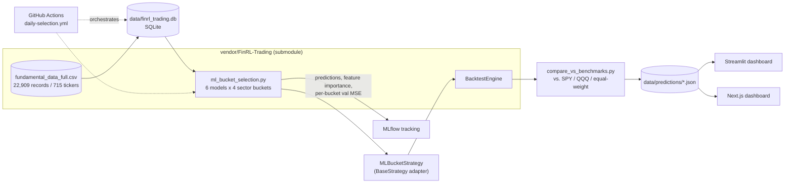

# ML Stock Selection Strategy

A per-sector ML ensemble that ranks the S&P 500 quarterly, wrapped in an
MLOps pipeline: tracked training, an independently-verified backtest,
containerized deployment, CI, and a live prediction dashboard.

## Results

Backtested 2017-06-02 to 2026-08-05 (36 quarters, including the COVID crash
and the 2022 bear market), selecting the top-3 performers per sector bucket:

| | Annualized return | Sharpe | Max drawdown |
|---|---|---|---|
| **Strategy** | **23.5%** | **0.93** | -40.6% |
| SPY | 15.2% | 0.82 | -33.7% |
| QQQ | 20.0% | 0.86 | -35.1% |


## Strategy

The model is based on FinRL-Trading's own `ml_bucket_selection.py`: for each of 4 GICS-style sector buckets (`growth_tech`, `cyclical`, `real_assets`, `defensive`), 6 regressors (Random Forest,
LightGBM, HistGradientBoosting, Extra Trees, Ridge, Stacking) compete on
validation MSE to predict next-quarter return from 52 fundamental factors
plus momentum, using point-in-time S&P 500 membership.

## Architecture



## Repo structure

```
stock-selection/
├── vendor/FinRL-Trading/       # git submodule, upstream untouched
│   ├── src/strategies/ml_bucket_selection.py   # the model
│   ├── src/backtest/backtest_engine.py         # the backtest engine
│   └── data/                                   # bundled historical dataset
├── app/
│   ├── data/build_fundamentals_db.py           # CSV -> local SQLite
│   ├── strategy/ml_bucket_strategy.py          # BaseStrategy adapter
│   ├── training/run_selection.py               # runs the model, logs to MLflow
│   └── reporting/                              # portfolio math, frontend JSON export
├── backtests/
│   ├── run_backtest.py                         # strategy vs. SPY/QQQ
│   └── compare_vs_benchmarks.py                # + equal-weight control
├── streamlit_app/app.py                        # frontend, minimal tier
├── frontend/                                   # frontend, Next.js + Recharts
├── data/predictions/{latest,history}.json      # committed pipeline output, both frontends read this
├── Dockerfile / docker-compose.yml             # training image; MLflow + Postgres tracking backend
├── .github/workflows/{ci,daily-selection}.yml  # lint/test/backtest-smoke; scheduled retrain-and-rank
└── tests/
```

In progress: `app/drift/` (monitoring, demoted to stretch), a FastAPI serving
layer, `notebooks/`.

## Getting started

```bash
git clone --recurse-submodules https://github.com/aluaz721/stock-selection.git
cd stock-selection
python -m venv .venv && source .venv/bin/activate
pip install -r requirements.txt

# Build the local fundamentals DB from the bundled dataset
python -m app.data.build_fundamentals_db

# Run the model for one quarter and log it to MLflow
python -m app.training.run_selection --db data/finrl_trading.db --val-cutoff 2025-09-30

# Backtest across multiple quarters vs. SPY/QQQ/equal-weight
python -m backtests.compare_vs_benchmarks \
  --db data/finrl_trading.db \
  --infer-dates 2024-03-31 2024-06-30 2024-09-30 2024-12-31 \
  --top-n-per-bucket 3
```

Run the tests with `pytest tests/`, lint with `ruff check .`.

### Frontends

Both read the same `data/predictions/{latest,history}.json` — regenerate
with `python -m app.reporting.build_frontend_data` after a new backtest run.

```bash
# Streamlit
streamlit run streamlit_app/app.py

# Next.js
cd frontend && npm install && npm run dev
```


## Tech stack

Python, scikit-learn, LightGBM, pandas, MLflow, `bt` (backtesting), SQLite,
Streamlit, Next.js, React, TypeScript, Recharts, Tailwind CSS, Docker,
GitHub Actions, pytest, ruff.

## Limitations

- **Max drawdown is worse than both benchmarks**, consistently, including
  independently across two separate multi-year sub-periods.
- **This project builds off of a published strategy.** See https://github.com/AI4Finance-Foundation/FinRL-Trading

Full decision log, including things tried and reverted, in
[`PROJECT_PLAN.md`](PROJECT_PLAN.md).


## License

This repo's own code has no license file yet. `vendor/FinRL-Trading/` is a
separate upstream project ([Apache 2.0](vendor/FinRL-Trading/LICENSE)),
vendored unmodified.
